# Learning AI

## Courses

### 1. Open Source Models with Hugging Face

- https://huggingface.co/
- models can have checkpoints with varying number of parameters.
- checkpoint refers to the saved model, including the pre-trained weights and all the necessary configurations.
- we often say we load a model, but technically speaking, we load a model checkpoint.
- depending on your hardware, you may not be able to run the largest checkpoints.
- traditionally, Hugging Face models stored weights in: pytorch_model.bin, which is just a serialized PyTorch checkpoint created via torch.save(). 
- however, many newer models (including whisper v3 Turbo) now use the .safetensors format instead.
- safetensors is:
  - safer (cannot execute arbitrary Python code during load)
  - faster (memory-mapped loading — no deserialization overhead)
  - portable (can be read from multiple frameworks, not just PyTorch)
- pytorch_model.bin file stores the trained weights of the model.
- the loaded model typically needs ~10–30 % more memory than the raw checkpoint
  - e.g. model.safetensors ~ 1.62 GB
  - 1.62 GB x 1.3 ~ 2.10 GB of memory needed   
- how find a model for a task, a dataset, or a demo? hugging face tasks:
  - [chat completion](https://huggingface.co/docs/inference-providers/en/tasks/chat-completion)
  - [feature extraction](https://huggingface.co/docs/inference-providers/en/tasks/feature-extraction)
  - [automatic speech recognition](https://huggingface.co/docs/inference-providers/en/tasks/automatic-speech-recognition)
  - [text to video](https://huggingface.co/docs/inference-providers/en/tasks/text-to-video)
- using a model with `transformers` library:
  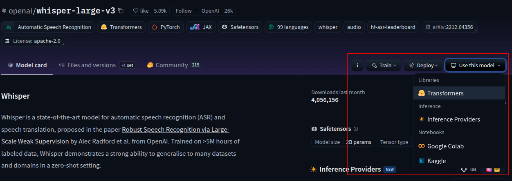
- the Pipeline object offers a high level abstraction to solve tasks:
    ```python
    # Use a pipeline as a high-level helper
    from transformers import pipeline
    
    pipe = pipeline("automatic-speech-recognition", model="openai/whisper-large-v3")
    ```
- so the pipeline library takes care of:
  - text to "tokens" conversion
  - audio to "logmel" spectrogram
  - images resizing and normalization (if needed)
- the transformers library doesn’t install PyTorch automatically because it’s designed to be framework-agnostic, so it can work with:
  - PyTorch (torch)
  - TensorFlow (tensorflow)
  - Flax (jax, flax)
- chat with open source models in https://huggingface.co/chat/
- what does “compiled kernel” mean? 
  - a kernel is a function that runs on your GPU (massively parallelized).
  - when PyTorch or any deep-learning library runs something like a matrix multiplication, it doesn’t send python code to the GPU — it calls pre-compiled CUDA kernels (binary machine code).
  - when PyTorch is built, it includes many of these kernels already compiled for specific GPU architectures. Each architecture is identified by a “compute capability” (e.g., 6.1, 7.5, 8.0, etc.).
  - the error: `CUDA error: no kernel image is available for execution on the device` means
    - your GPU asked to execute CUDA code, but this PyTorch build doesn’t include a binary (‘kernel image’) compiled for that GPU’s architecture.
- what does sm_61 mean?  
  - streaming Multiprocessor architecture 6.1
  - my gpu GTX 1060 (sm_61) / Pascal architecture
  - each generation of NVIDIA GPUs has a numeric compute capability, which tells software what instructions, tensor cores, and memory features it supports.
  - PyTorch wheels only embed kernels for a subset of these.

| GPU Family        | Architecture Name | Compute Capability | Code      |
| ----------------- | ----------------- | ------------------ | --------- |
| GTX 900 (Maxwell) | Maxwell           | 5.2                | sm_52     |
| GTX 10xx (Pascal) | Pascal            | 6.1                | **sm_61** |
| RTX 20xx (Turing) | Turing            | 7.5                | sm_75     |
| RTX 30xx (Ampere) | Ampere            | 8.6                | sm_86     |
| RTX 40xx (Ada)    | Ada Lovelace      | 8.9                | sm_89     |
| H100              | Hopper            | 9.0+               | sm_90     |

- the [open llm leader board](https://huggingface.co/open-llm-leaderboard) aims to track, rank and evaluates open LLMs and chatbots.
- the [lm arena](https://huggingface.co/spaces/lmarena-ai/chatbot-arena) rankings across various LLMs on their versatility, linguistic precision, and cultural context across text.
- pretrained models are models that were train from scratch, mainly from big companies with access to the compute
- [facebook not language left behind (NLLB)](https://huggingface.co/facebook/nllb-200-distilled-600M) - machine translation model primarily intended for research in machine translation
- what exactly is a tokenizer? 
  - a tokenizer is the component that converts raw text (strings) into numbers (token IDs) that the model can understand.
  - "Hello world"  →  [15496, 995]
  - models only understand numbers. 
  - the tokenizer is the dictionary.
- can you share a tokenizer across different models?
  - no, not safely (unless the models use exactly the same vocabulary).
  - you cannot share tokenizers between unrelated models
    - GPT-2 tokenizer on a BERT model
    - NLLB tokenizer on T5
    - LLaMA tokenizer on Mistral
  - you can share tokenizers between models that:
    - come from the same family
    - use the same vocabulary (e.g. facebook/nllb-200-distilled-600M, facebook/nllb-200-1.3B)
    - have the same tokenization scheme
    - tokenizers runs in the CPU
- `all-MiniLM-L6-v2` model: it’s a sentence-embedding model from the Sentence‑Transformers library. It maps sentences (or short paragraphs) into a 384-dimensional dense vector space.
  - architecture wise: it’s based on the “MiniLM” family
  - it's fine-tuned for sentence similarity / semantic search tasks
  - high throughput for embedding many sentences.
  - it gives a very decent trade-off of accuracy vs cost.
- other sentence-embedding models: https://www.sbert.net/docs/sentence_transformer/pretrained_models.html

| Model                                 | Better if you need…                                                                     | Trade-offs                                                     |
| ------------------------------------- | --------------------------------------------------------------------------------------- | -------------------------------------------------------------- |
| all-mpnet-base-v2                     | **Higher accuracy** for embedding quality (semantic search, retrieval) ([sbert.net][1]) | Slower, larger model, more resource usage                      |
| paraphrase-multilingual-MiniLM-L12-v2 | Good for **multilingual** embeddings (many languages) ([Medium][2])                     | Slightly larger than L6 version, maybe slightly less efficient |
| multi-qa-mpnet-base-cos-v1            | For **question-answering / retrieval** heavy tasks (domain specific) ([sbert.net][1])   | More specialized, maybe overkill for simple embedding tasks    |

- audio data:
  - sampling           = measuring the value of a continuous signal at fixed time steps.
  - sampling rate (Hz) = the number of samples taken in one second
  - 8,000 Hz (8KHz): telephone / walkie-talkie
  - 16,000 Hz (16KHz): human speech recording
  - 192,000 Hz (192Khz): high-resolution audio
  - for example, 5-second sound:
    - 8,000 Hz => 5 * 8000 = 40,000 signal values
    - 16,000 Hz => 5 * 16000 = 80,000 signal values
    - 192,000 Hz => 5 * 192000 = 960,000 signal values
  - why is the sampling rate important when working with AI models?
    - it determines how much detail you capture, e.g. 44.1 kHz captures all frequencies humans can hear.
    - models don’t inherently understand different sampling rates, so if the model learned patterns based on say 16,000 samples per second it will interpret new input as if one second = 16,000 samples.
    - it impacts model size, training speed, and memory.
  - if a model is trained at 16,000 Hz and you feed it 10 seconds of audio sampled at 192,000 Hz (without resampling), the model will interpret the input as much longer than it actually is.
    - 10 seconds x 192,000 samples/sec = 1,920,000 samples
    - 1,920,000 samples / 16,000 samples/sec = 120 seconds
  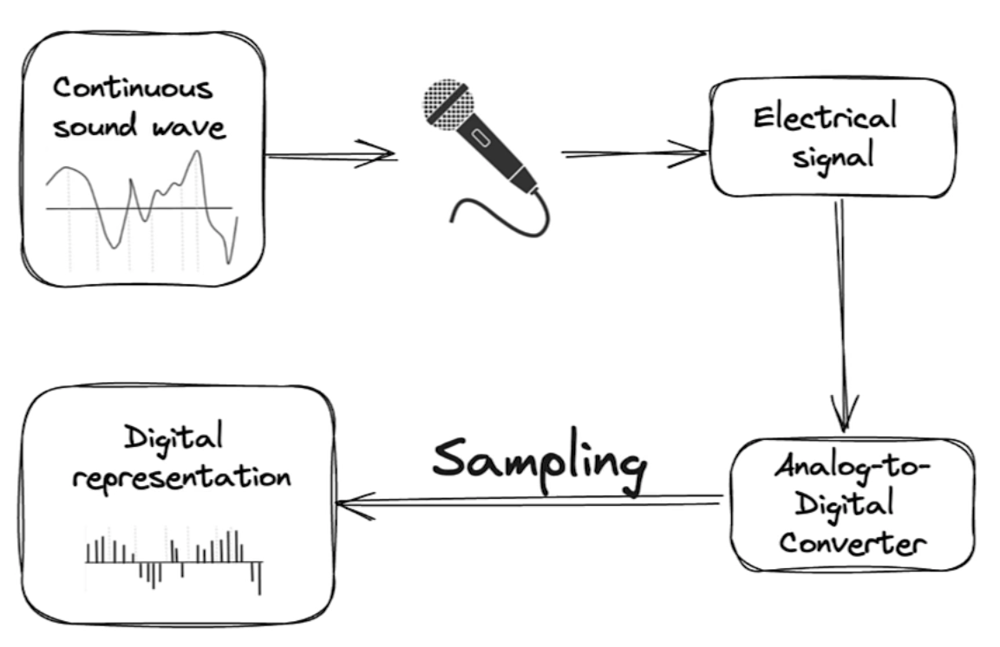
  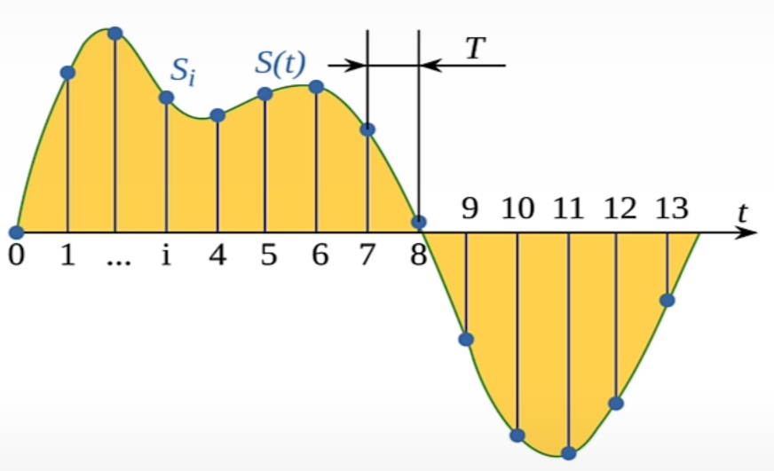

- the `ESC50 dataset` is a labeled collection of five-second environmental sounds, such as sounds made by animals and humans, nature sounds, indoor sounds, urban noises. 
  - `ashraq/esc50` points to the ESC-50 dataset repository on Hugging Face
- in zero-shot audio classification uses user-supplied `candidate_labels`, arbitrary descriptive phrases that the model scores against the audio clips.
  - `laion/clap-htsat-unfused` is the CLAP audio–text mode
  - CLAP stands for Contrastive Language-Audio Pretraining—it’s the technique used to train the zero-shot audio/text model.
  - here “contrastive” means the model learns by comparing matched vs. mismatched pairs—e.g., an audio clip with its true text caption and the same clip with unrelated captions. During training, it pulls the embeddings of true pairs closer together and pushes apart those of mismatched pairs. That contrastive objective teaches the model a joint audio–text space where similarity directly reflects semantic alignment.
- Automatic Speech Recognition is a task that involves transcribing speech audio recording into text.
  - meeting notes
  - videos subtitles
- what a distilled model? a distilled model is:
  - a compressed version of a bigger model
  - trained not on raw human data, but on the teacher model’s outputs 
  - designed to be faster, cheaper, and more efficient 
  - while keeping as much of the teacher’s accuracy and behavior as possible
- stereo audio adds a spatial component that enhances the listening experience for music.
  - stereo audio has a left and a right channel, similar to how humans have two ears. this lets a system compare what is heard on each side. 
  - a sound arriving at one "ear" slightly earlier than the other gives clues about its direction (e.g. a sound reaches the left channel a few milliseconds earlier → the source is on the left.)
  - a sound may be louder in one channel than the other, also indicating direction. (e.g. example: louder in the right channel → source is likely on the right)
- for transformer models, stereo is usually unnecessary; they typically use mono audio.
- tasks like recognizing a dog bark, a cat meow, or spoken words don’t require knowing the sound’s spatial location.
- mono is sufficient because the model only needs to know what was said or heard, not where it came from.
- stereo has two channels (twice the data), which increases computational complexity without offering meaningful benefits for most transformer audio tasks.

- for models the batch size can be seen as a multiplier of the memory requirement.
  - example: `- asr(audio_16KHz, chunk_length_s=30, batch_size=4, return_timestamps=True)["chunks"]`
- it represents how many models (or inputs) you can run in parallel. 
- if your hardware has enough capacity, you can use a larger batch size (more batches at the same time).

- why text-to-speech is a challenging task? 
  - it is a one-to-many problem. in classification, you have one correct label, maybe a few... 
  - in automatic speech recognition, there's one correct transcription for a given text.
  - however, there's an infinite amount of ways to say the same sentence.
  - each person has a different way of speaking, but they are all valid and correct.
  - think about different voices, dialects, speaking styles, and so on.

- what is end-to-end object detection? end-to-end object detection refers to object-detection systems where the entire process — from input image → bounding boxes + object labels — is learned and optimized in one unified neural network, without needing hand-crafted components or multi-stage pipelines.
  - [DETR (End-to-End Object Detection) model with ResNet-50 backbone](https://huggingface.co/facebook/detr-resnet-50)
  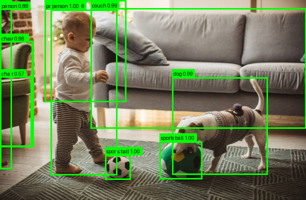
- what is segmentation mask generation? is a computer-vision task where an AI model produces a pixel-accurate outline (mask) of objects in an image — without necessarily identifying what the object is.
This is sometimes called class-agnostic segmentation.
  - [SlimSAM-uniform-77](https://huggingface.co/Zigeng/SlimSAM-uniform-77)
  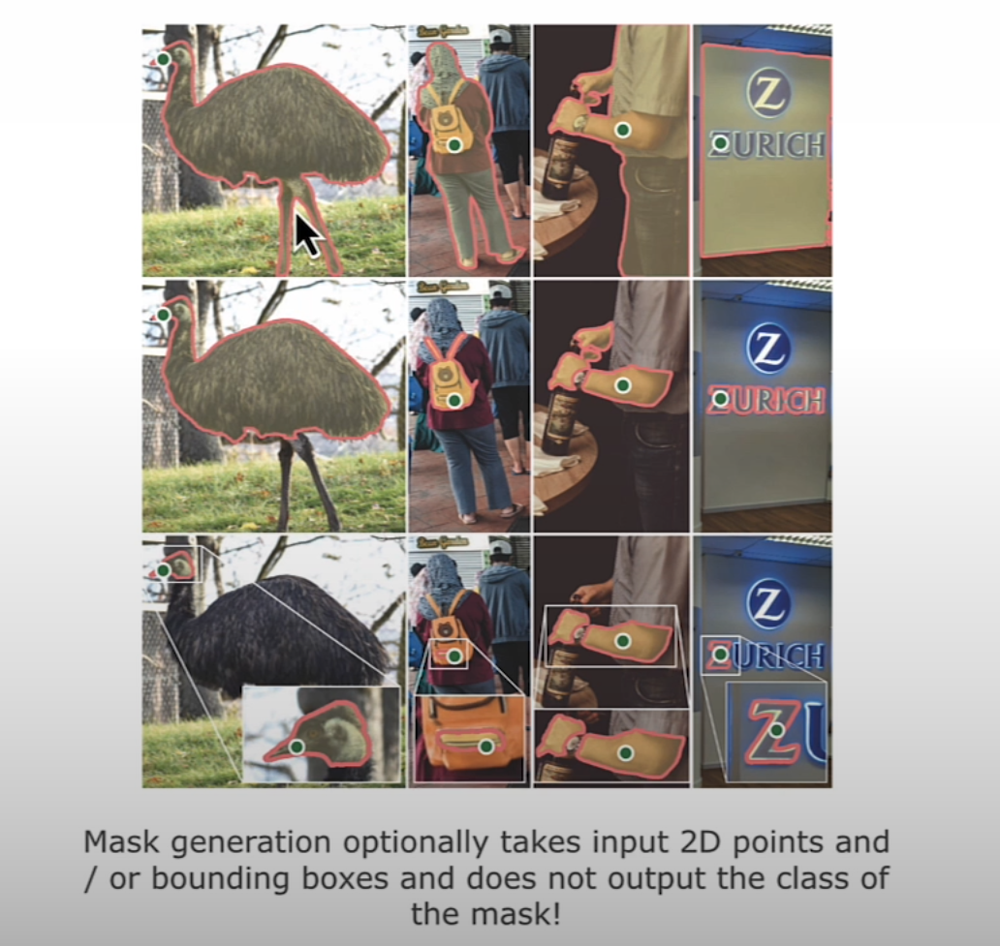


### 2. Stanford CS231N

- [Python Numpy Tutorial](https://cs231n.github.io/python-numpy-tutorial)
- [Repository](https://github.com/cs231n/cs231n.github.io)
- [Website](https://cs231n.stanford.edu/index.html)
- what is image classification? is the task of taking an image and assigning it to one label from a fixed set of categories (for example, “cat” or “dog”).
- why image classification is hard?
  - the semantic gap: there is a difference in how we perceived the image and how a machine perceived the image, humans understand images based on meaning and context, while machines only see raw pixels.
  
  - viewpoint variation: for us humans there is not much difference, from the machine perspective all pixels change when the camera moves! 
  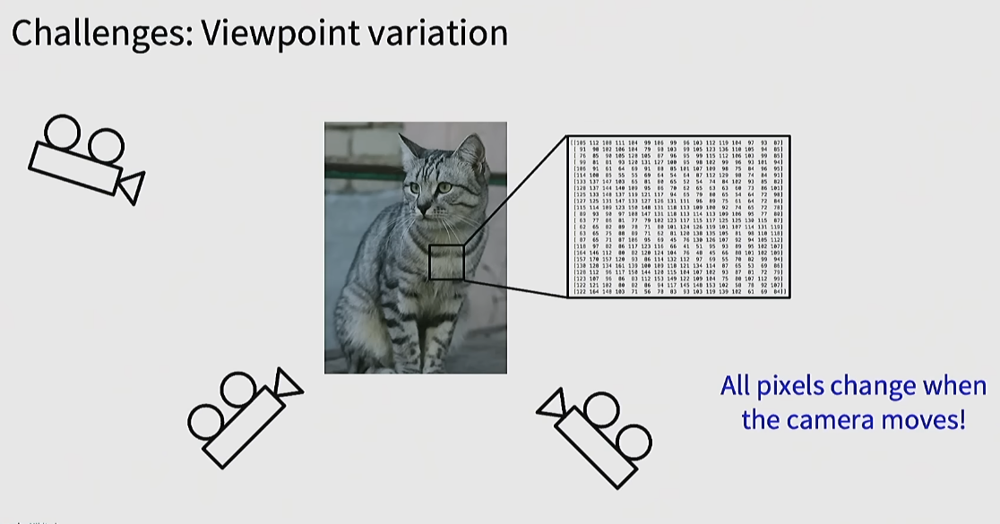
  - ilumination: the value of each rgb pixel are usually a function of the surface material, color and light source, and that is why same cat (same object) may look different under distinct ilumination conditions.   
  
  - background clutter: there are many things in the background that make it harder to clearly see the object you want to recognize.
  
  - occlusion: part of the object you want to recognize is hidden.
  
  - deformation: the object could look very different from its usual shape or pose.
  
  - intra class variation: objects from the same category can look very different.
  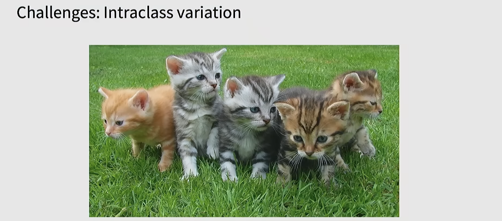
  - context: the surroundings of an object can influence how it’s recognized.
  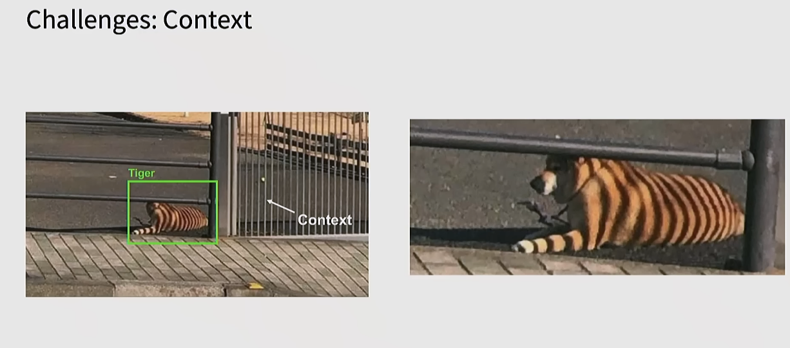
  
- algorithmic approach: before modern data-driven methods (like deep learning), people tried to classify images using hand-crafted rules.
  - first, detect simple features like edges. 
  - then detect more specific features like corners or shapes. 
  - finally, try to combine these manually defined features to decide what the object is.
  - the problem: these rules were too simple and couldn’t capture all the variations in real images (different poses, lighting, shapes, backgrounds). in addition, this approach does not scale you have to repeat for each new object to classify.
    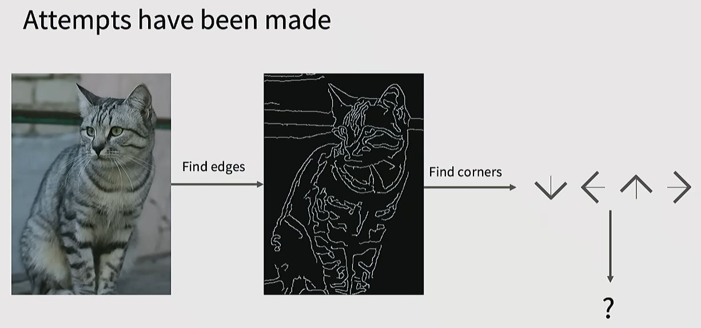
- data-driven approach: instead of designing features by hand, we let the model learn the right features automatically from large amounts of data.
  
- distance metrics to compare images:
  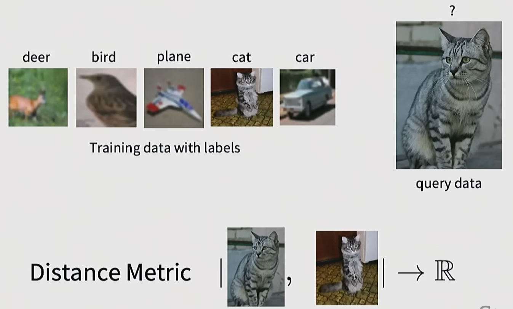 
  - L1 distance: (also called Manhattan distance) is a way to measure how different two things are by adding up the absolute differences between each of their corresponding components (pixels, numbers, features, etc.).
  - L2 distance: (also called Euclidan distance) measures how far two points (or images, or vectors) are by taking the square root of the sum of squared differences between their corresponding components. it’s the straight-line distance between them.
  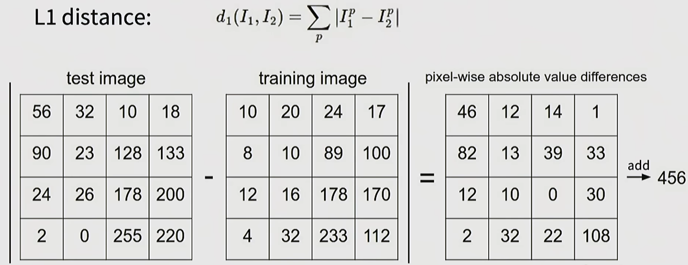
  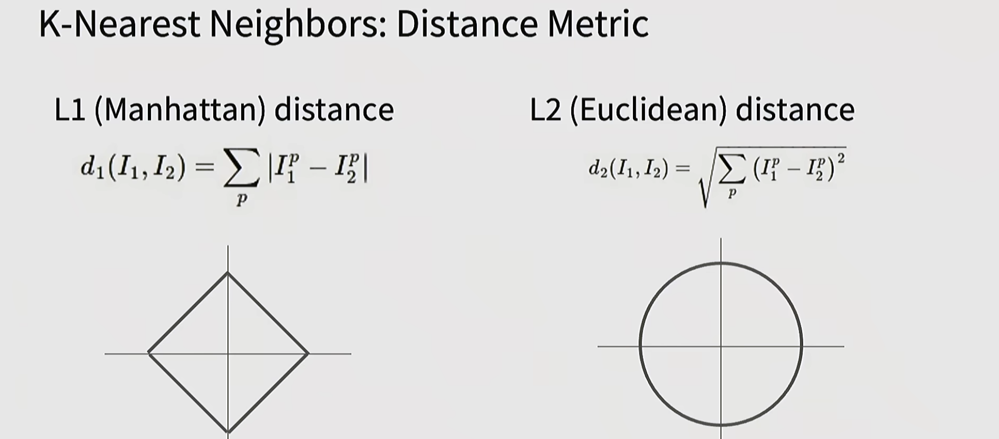
  
    - what is the problem with L1 distance? despite training being O(1) since there’s nothing to learn, calculating the distance to all images is O(n)! if the dataset grows... for example, to a trillion images — this becomes impractical. it’s better to use an algorithm that’s faster at prediction (inference) time.
- what is accuracy? accuracy (in simple terms) means how often we get the correct answer.
  - accuracy = total number of predictions / number of correct predictions
- what is precision? of all the things the model said were positive, how many were actually positive?
  - precision = true positives / true positives + false positives
  - example: How many of the people the detective arrested were actually criminals? 
    - he arrested 20 people. 
    - 15 were real criminals. 
    - precision = 75% 
    - this is about not arresting innocent people.
    - precision → “did we catch the right ones?”
- what is recall? of all the actual positives, how many did the model correctly find?”
  - recall = true positives / true positives + false negatives
  - example: How many criminals did the detective find? 
    - there were 100 real criminals. 
    - he caught 80. 
    - recall = 80% 
    - this is about not missing any real criminals.
    - recall → “did we catch them all?”
- what does the majority voting means in the k-nearest neighbors algorithm?
  - when you want to classify a new point:
  - the algorithm finds the K closest training points (its “neighbors”). 
  - each of those neighbors has a known class label. 
  - the algorithm counts how many neighbors belong to each class. 
  - the class with the highest count (the majority) is assigned to the new point.
  - suppose K = 5, and the 5 nearest neighbors have labels:
  - 3 are green, 1 is blue, 1 is red 
  - the majority class is green, so the new point is classified as green.
  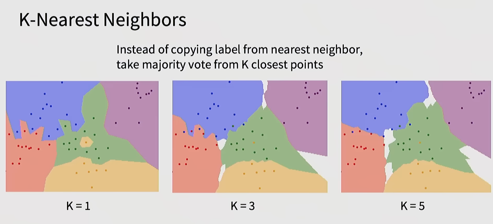
- what are hyperparameters? hyperparameters are settings you choose before training a machine learning model.
they control how the model learns, but the model does not learn them by itself. think of hyperparameters like cooking settings (temperature, time):
they affect the result, but the oven doesn’t set them—you do.
  
  
  - Idea #1: ❌ Bad idea 
    - because the model may overfit the training data (e.g., K=1 gives perfect training accuracy), and it won’t generalize to new data.
  - Idea #2: ❌ Bad idea
    - because you are using the test data to tune the model, so the test data is no longer a fair measure of performance. you lose the ability to evaluate on truly new data.
  - Idea #3: ✔ Better idea
    - because the validation set is used for tuning, and the test set stays untouched until the end, giving an honest evaluation of how well the model generalizes.
  - Idea #4: ✔ Good idea
    - because it gives a more reliable estimate of how your hyperparameters will perform on new data, especially when the dataset is small.
- why k-nearest neighbor on images is never used?
  - very inefficient
  - distance metrics on images which are very high dimensional objects they act on very unnatural unintuitive ways.
    

- what is a linear classifier? a linear classifier is a simple machine-learning model that makes predictions using a straight-line (linear) decision boundary. a linear classifier tries to separate data into classes using a line, plane, or hyperplane. it cannot learn complex shapes — only straight boundaries.
  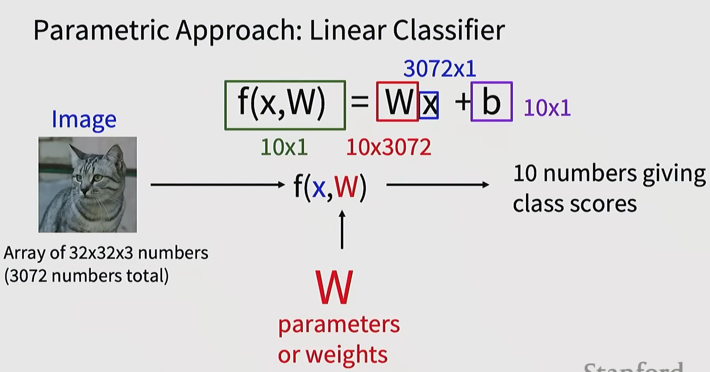
  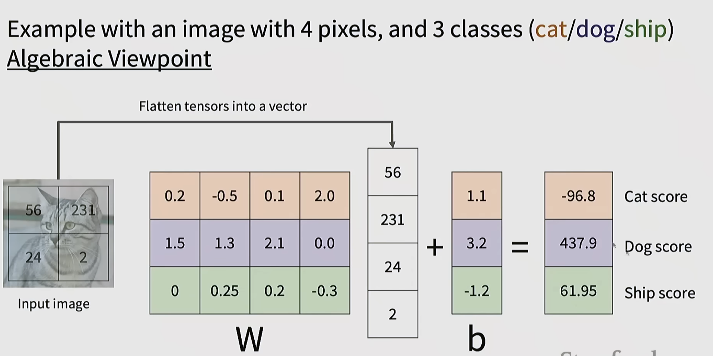
  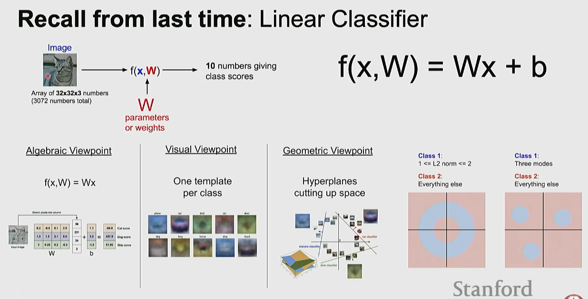
  - the cat image is turned into a long list of numbers (3072 numbers).
  - the model uses a weight matrix (W) and bias (b) to compute: f(x, W) = Wx + b
  - the result is 10 numbers, each representing a score for a class (e.g., cat, dog, car, etc.).
  - a linear classifier just multiplies the input by weights and adds a bias — nothing fancy.
  - note that in the last image, each row of W can be viewed as a “template” image showing what the model has learned for each class.
  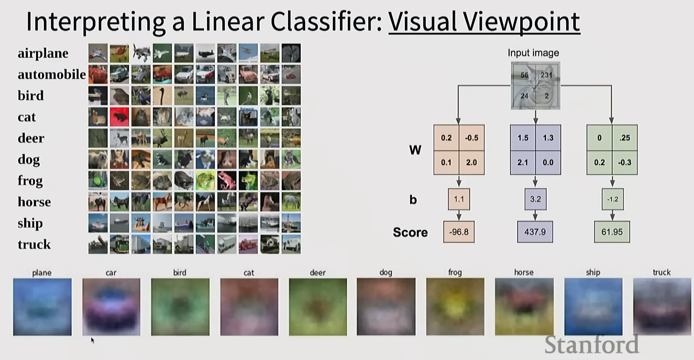
  - a linear classifier tries to separate images (like cars, airplanes, deer) using straight lines (or planes in higher dimensions). if an image falls on one side of the line, the classifier scores it higher; if it falls on the other side, the score is lower.
  - those blurry pictures are the W rows visualized, basically what each classifier “looks for.”, each row of W acts like a template.
  

- neural networks = many simple linear classifiers stacked together!
  - more layers = more power to learn complex patterns.
  - each LEGO block represents a linear classifier.
  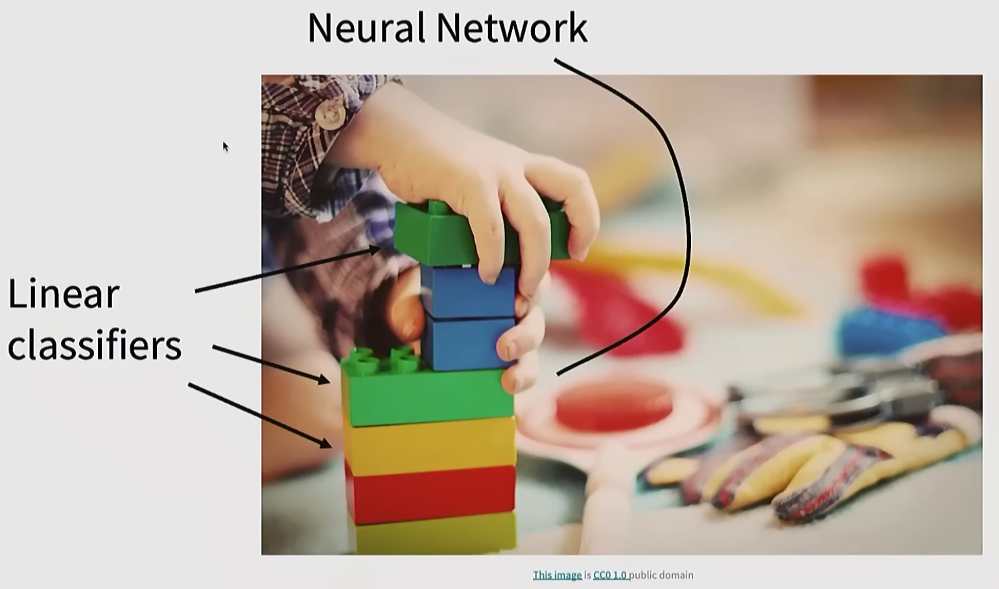
  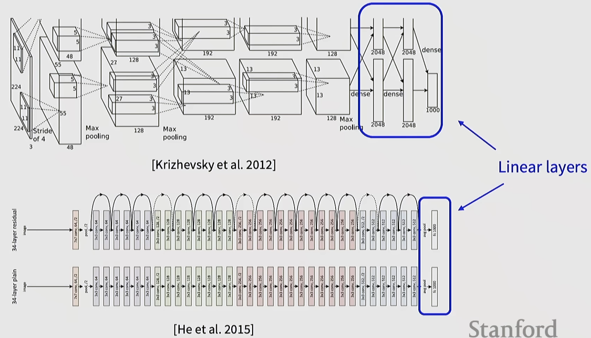

- what are hard cases for linear classifier? 
  - the following examples show why linear classifiers are limited. 
  - they fail on data that is non-linear, circular, or consists of multiple disconnected regions. 
  - that’s why we stack layers (neural networks) to handle these shapes.
  

- what is a loss function? 
  - a loss function in simple terms tells you how "bad" a model is!
  - a loss function measures the difference between what the model predicted and what the correct answer should be.
  - good prediction(s) → low loss 
  - bad prediction(s)  → high loss
  - the goal during training is to adjust W (the weights) so that the loss becomes as small as possible.
   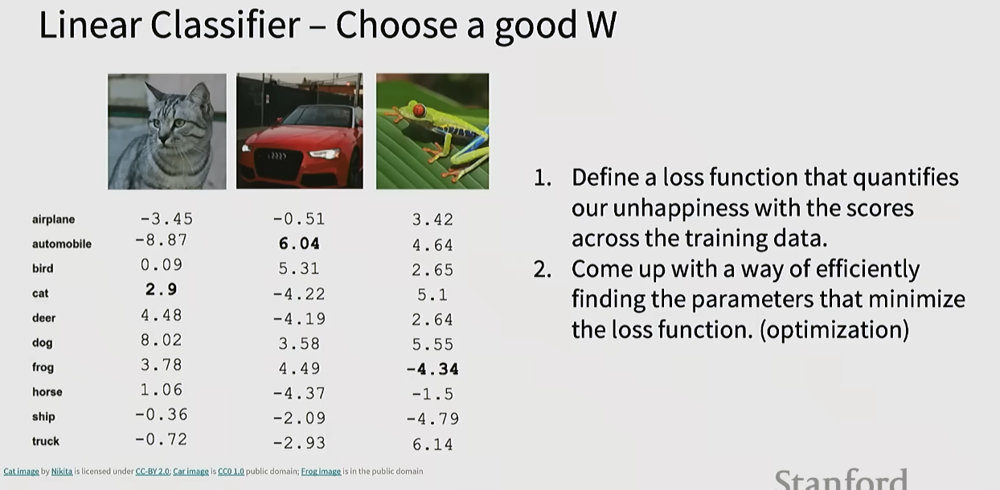
   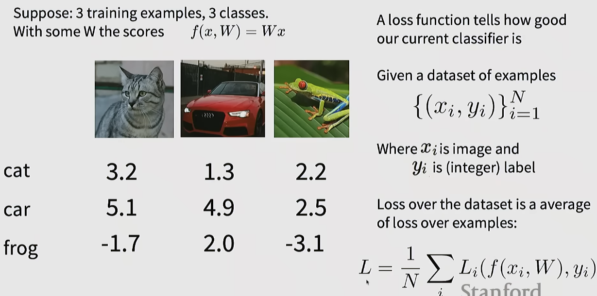 

- how a softmax classifier turns raw scores into probabilities? the softmax classifier turns raw scores into probabilities, then uses the negative log-probability of the correct class as the loss to train the model.
  
  - the linear classifier produces raw numbers:
    - cat: **3.2**
    - car: **5.1**
    - frog: **–1.7**
  - these are not probabilities. 
  - they can be negative, and they don’t sum to 1.
  - apply `exp()` to make everything positive
  - we take the exponential of each number:
    - exp(3.2)  → **24.5**
    - exp(5.1)  → **164.0**
    - exp(–1.7) → **0.18**
  - now everything is **positive**, but still not a probability.
  - normalize to make them sum to 1 → Softmax
  - sum = 24.5 + 164.0 + 0.18 ≈ **188.7**
  - probabilities:
    - cat: **0.13**
    - car: **0.87**
    - frog: **0.00**
  - so the model thinks the image is **87% car**, **13% cat**, **0% frog**.

- how to compute the loss (cross-entropy loss) for the training?
  - if the *true label* is **cat**, we look at the probability for “cat,” which is **0.13**.
  - the loss is:
    - **L = –log(0.13) ≈ 2.04**
    - this penalizes the model for giving the correct class a low probability.
    - so... we adjust the weights **W** so that the probability of the correct class becomes higher.
    - mathematically, we want to **maximize the probability of the true class**, or equivalently: **minimize the loss**.

- what does cross-entropy measures? cross-entropy measures how different the predicted probabilities are from the true probabilities.
  
  - so what is H(P, Q)?
    - H(P, Q) = – Σ P(i) log Q(i) 
    - P = the true distribution
    - (the purple vector: 1 for cat, 0 for everything else) => [1, 0, 0]
    - Q = the model’s predicted distribution
    - (the green vector: 0.13 cat, 0.87 car, 0.0 frog)
    - H(P, Q) = “How different is Q from P?”
    - if Q matches P perfectly → H(P, Q) is small
    - if Q is very wrong → H(P, Q) is large
  - note in this case softmax loss = cross-entropy loss, not necessarily always like this.

- why do we use –log for cross-entropy and loss?
  - because –log(probability) gives a perfect numerical penalty for “how wrong” the model is.
  - loss = –log(0.99) ≈ 0.01 → **Very small penalty (good)**
  - loss = –log(0.01) = 4.60 → **HUGE penalty**

- multiclass SVM loss:
  - we look at all the incorrect classes.
  - for each one, we compute: sj - sy + 1
  - if this value is > 0, the incorrect score is too high → penalty.
  - if it is ≤ 0, the incorrect score is comfortably lower → no penalty.
  - the total loss for that example is the sum of these penalties.
  - “if an incorrect class score is higher than (correct score – 1), we add loss. otherwise, we add nothing.”
  - 🚫 today SVM loss is rarely used in deep learning. 
  - softmax + cross-entropy has completely replaced SVM loss.
  - all modern frameworks (PyTorch, TensorFlow, JAX) standardize on softmax cross-entropy
  
  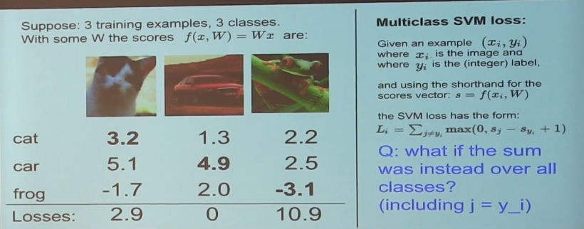

- what is the point of regularization?
  - prevent the model from doing too well on training data
  - express preferences over weights
  - make the model simple so it works on test data
  - improve optimization by adding curvature
  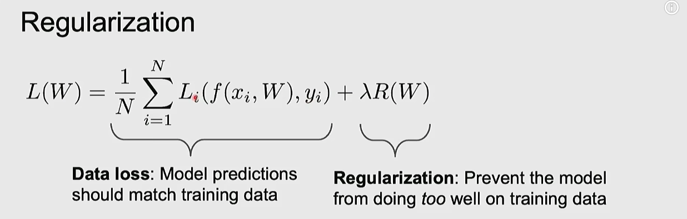
  
  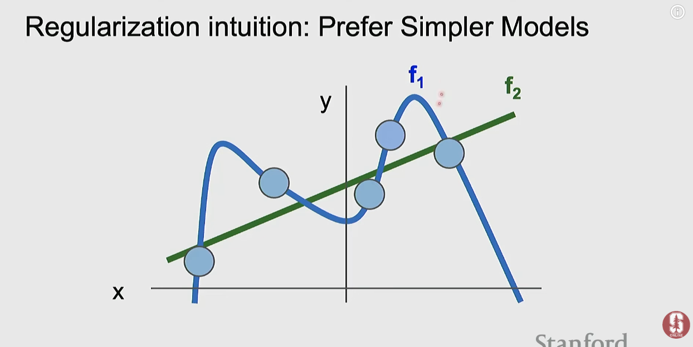
  - f₁ = a very complex model
    - it might perfectly fit the training data, but it is overfitting:
  - f₂ = a simple model
    - doesn’t pass through all points perfectly. 
    - but captures the overall trend.
    - it generalizes better.
  - so... regularization adds a penalty for complexity.
  - λ controls how much the model should care about simplicity vs accuracy.
  - if λ is small -> regularization is "weak"
  - if λ is large -> regularization is strong
  - you are literally choosing how much you want to punish complexity.

- what are the types of regularization?
  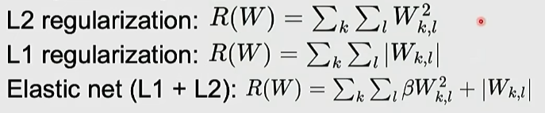
  - other more advance types:
  

- which of w1 or w2 will the L2 regularizer prefer?
  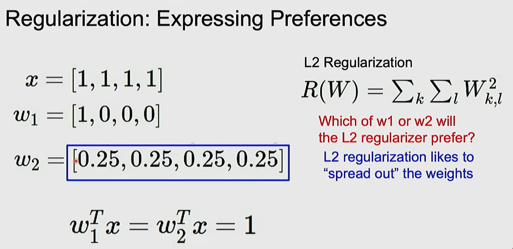

- why the semicolons in `f(x;W) = Wx`?
  - mathematicians use “;” to separate regular inputs from parameters of a function, so readers immediately know those variables play different roles.
  - x = the main variable the function acts on
  - x = image 
  - W = model weights 
  - **W** is not an input in the traditional function sense — it's a parameter we optimize

- why do we use softmax? 
  - softmax is popular because it converts scores into probabilities and gives a smooth, stable loss that works extremely well with gradient descent — making it the best choice for multi-class classification in deep learning.
  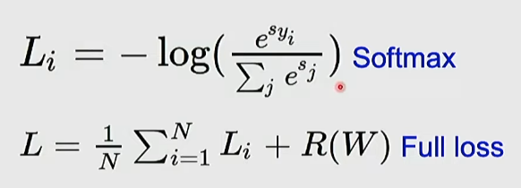

- why should not calculate the derivative this way?
  
  - this is one of the core ideas behind why we use analytic gradients (backpropagation) instead of numerical gradients.
  - for each parameter by nudging it slightly and observing the change in loss.
  - **reason 1:** it is extremely slow
    - 1,000 weights → 1,000 numerical derivatives
    - a modern neural network: 10 million weights → 10 million loss evaluations
    - why so slow? 
      - copy the entire model
      - add ℎ to one weight
      - compute the whole forward pass
      - compute the loss
    - backpropagation computes all gradients at once with one forward pass + one backward pass.
  - numerical gradient: O(number of weights)
  - backpropagation: O(1) relative to model size
  - **reason 2:** it is inaccurate
    - when h is tiny (like 0.0001), floating point error becomes huge.
  - **reason 3:** it is very sensitive to the choice of **h**
    - if h is too large → gradient is inaccurate
    - if h is too small → floating point errors dominate
    - no single value of h works well for all situations.
    - backpropagation does not have this problem at all.
  - **reason 4:** You must repeat a full forward pass for EVERY weight
    - with millions of weights, training would take years.
    - this is why neural networks are even possible today.
  - **reason 5:** you cannot use numerical gradients for training
    - they are too noisy and too slow.
    - people sometimes use numerical gradients only to check (verify) that a backprop implementation is correct — but never for real training.

- a vector of derivatives is a "gradient"!

- what is the alternative for computing those derivatives?
  - use "analytic" gradient.
  - do not use "numerical" gradient.
  
  
  
- what is a convex function?
  - a convex function is shaped like a bowl. there is only one lowest point, and gradient descent will always find it.
  - it has one global minimum
  - example: f(x) = x^2

- what is a non-convex function?
  - a non-convex function is shaped like a mountain landscape with many valleys.
  - has multiple local minima
  - example: f(x) = sin(x)

- what is a non-differentiable function?
  - a non-differentiable point is a sharp point where you cannot draw a unique tangent line.
  - f(x) = ∣x∣ no unique slope → derivative does not exist at 0.
  - a function can be:
    - convex and non-differentiable (e.g., |x| is convex but has a corner)
    - non-convex and differentiable (e.g., sin(x))

- what is gradient descent?
  - gradient descent is an algorithm used to find the min. of a function in ML, that function is the loss.
  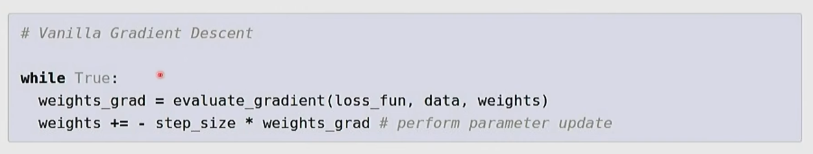
  

- what is the learning rate in gradient descent (or other optimizers)?
  - the learning rate (also called step size) is one of the most important hyperparameters in gradient descent.
  - the learning rate controls how big a step gradient descent takes each time it updates the weights.
  - ✔ small η → tiny steps
  - ✔ large η → big steps
  - intuition:
    - if your steps are too big → you overshoot, bounce around, or even fly off the hill. 
    - if your steps are too small → you move very slowly.
    - if your steps are just right → you smoothly descend to the minimum.
  
  - what you can do to improve learning rates while training?
  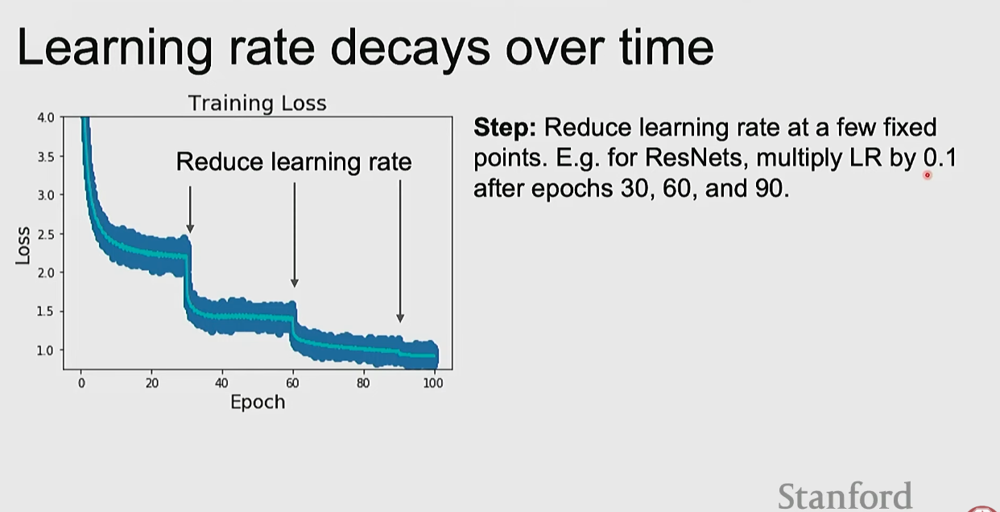
  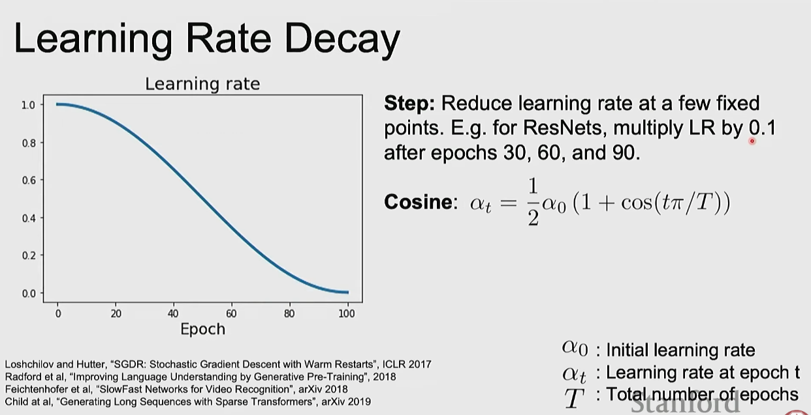
  
  

- what is stochastic gradient descent (SGD)?
  - is a type of gradient descent that updates the model using only a small random batch of data each step, making training faster and more scalable than computing the gradient on the entire dataset.
  - “stochastic” means random.
  - the gradient you compute each step is random because each minibatch is random.
  - it's not the true gradient — it's a noisy estimate.
  

- why SGD is used everywhere in deep learning? 
  - ✔ much faster than full gradient descent 
  - ✔ works well with huge datasets (ImageNet, etc.)
  - ✔ the noise helps escape poor minima and improves generalization 
  - ✔ works well with GPU batching 
  - ✔ all modern optimizers (Adam, RMSprop, Momentum) are built on top of SGD

- what are some of the problems of SGD?
  
  1. very slow progress along shallow dimension, jitter along steep direction.
    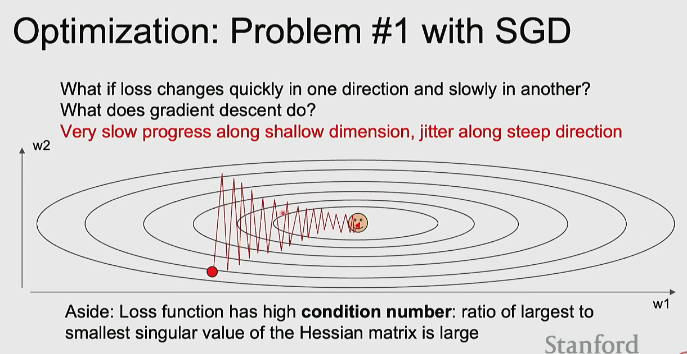
  2. zero gradient, gradient descent gets "stuck". for example in a saddle point, the gradient is zero in all directions, so you could get stuck...
    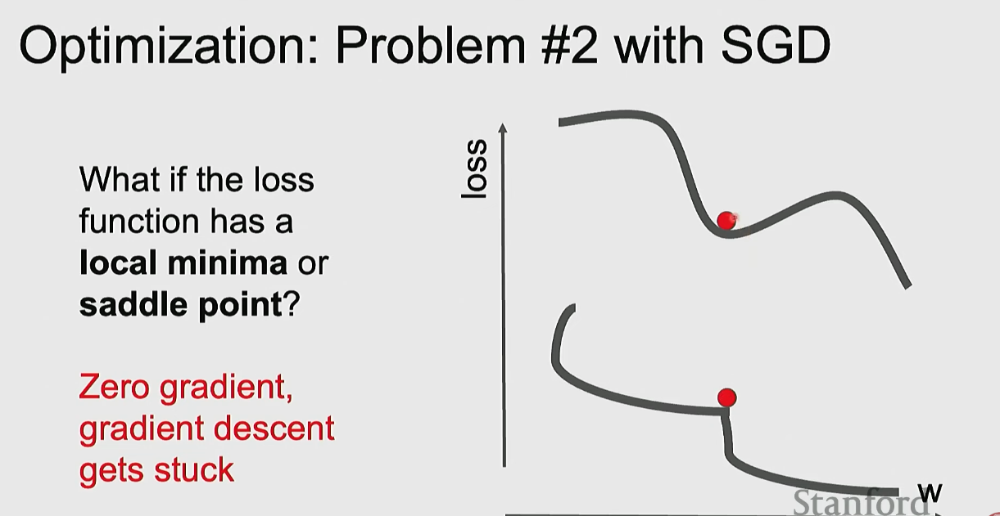
    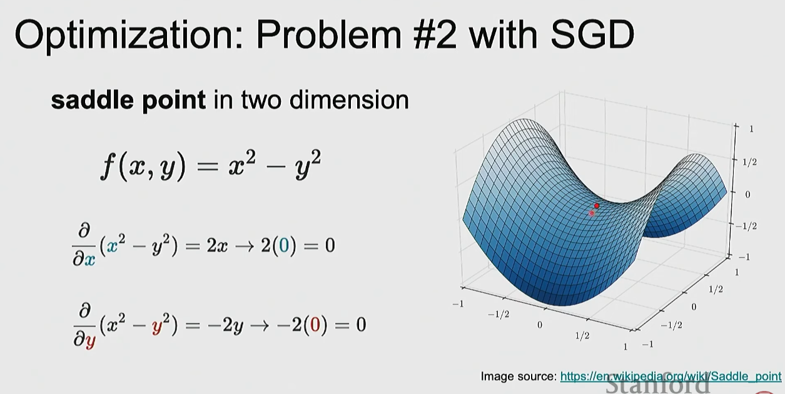
  3. our gradients come from minibatches so they can be noisy! look at the path it follows, is messy...
    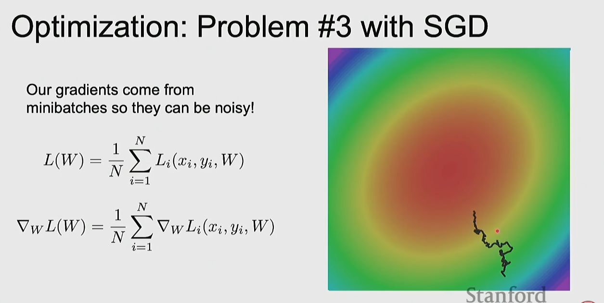

- what is SGD with momentum?
  - it helps SGD to:
    - escape saddle points
    - reduce oscillations
    - move faster along shallow but consistent slopes
    - converge faster and more smoothly
  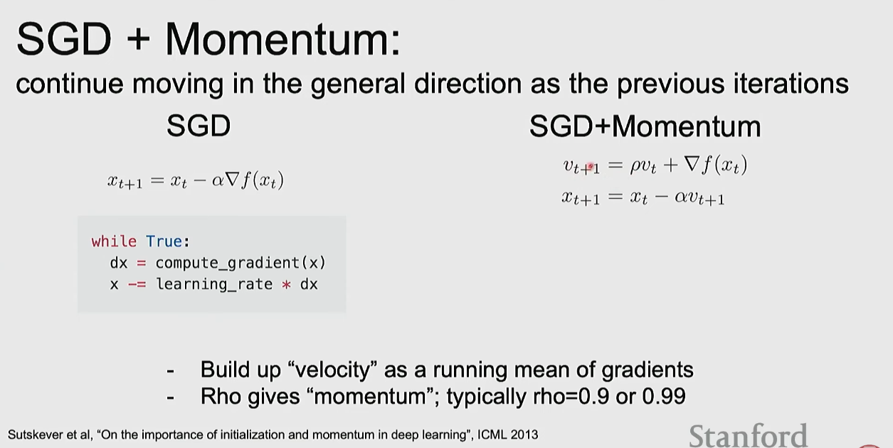

- what is RMSProp?
  - RMSProp (Root Mean Square Propagation) is an adaptive learning rate optimization algorithm commonly used when training neural networks. It was proposed by Geoffrey Hinton.

- what is Adam optimizer?
  - Adam (Adaptive Moment Estimation) is one of the most popular optimization algorithms for training neural networks. Think of it as a combination of Momentum + RMSProp, with some extra fixes.
  - first_moment → average of gradients (momentum) “where we were heading”
    - first_moment to get a smooth direction
    - 90% = “where we were heading”
  - second_moment → average of squared gradients (RMSProp)
    - second_moment to get a per-dimension normalized step size
    - 10% = “new gradient direction”
  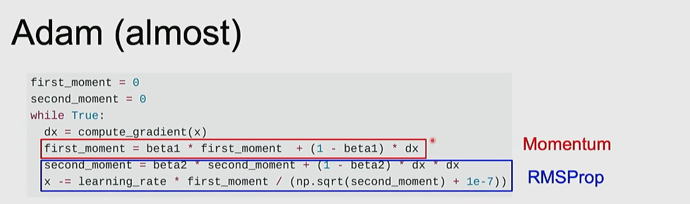
  
  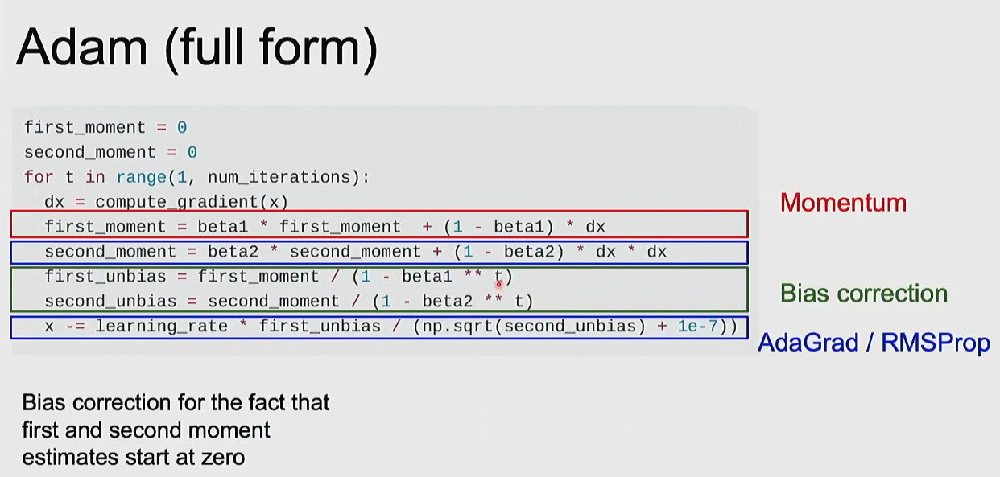
  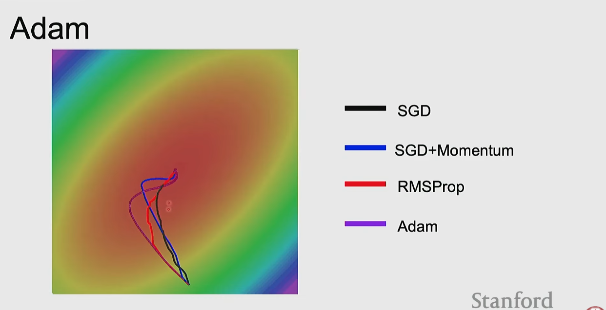

- what is the difference between AdamW and Adam?
  - **Adam** weight decay is applied inside the gradient → gets distorted by momentum/RMS scaling.
  - **AdamW** weight decay is applied outside the gradient → pure, correct shrinking of weights.
  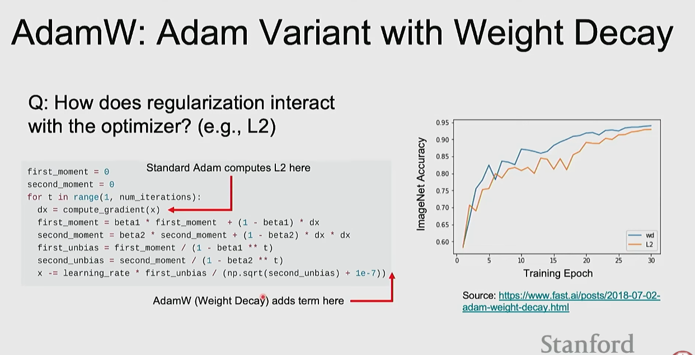

- what is weight decay?
  - is a regularization technique used during training to keep neural network weights small so the model doesn’t overfit.
  - weight decay = shrinking the weights a tiny bit on every update.
  - without weight decay: `x ← x - learning_rate * gradient`
  - with weight decay (strength λ):
    - `x ← x - learning_rate * gradient`
    - `x ← x - learning_rate * λ * x`
  - why do we want weights to be small?
    - large weights make the model very flexible → risk of memorizing training data
    - small weights produce smoother, simpler functions → better generalization
    - prevents exploding weights
    - works like L2 regularization
  - 🎯 Weight decay = L2 regularization
    - if you add an L2 penalty to the loss: `loss_total = loss + λ * ||x||²`
    - and take gradient steps, you get the same “shrinking” effect.
    - so weight decay is basically a practical version of L2 regularization inside the optimizer.
    - (normally the L2 regularization it is part of the loss function.)

- what is an optimizer?
  - in machine learning, an optimizer is an algorithm that adjusts a model’s parameters (weights and biases) to reduce the error between the model’s predictions and the true targets.
  - optimizers are just teaching "styles":
    - SGD = reacts immediately to your advice
    - Momentum = remembers past advice
    - RMSProp = slows down when advice becomes too wild
    - Adam = combines both remembering + slowing down
    - AdamW = Adam but with healthier habits
  

- what are second-order optimizations? and why are there not use in deep learning?
  - let's start with some intuition...
  - imagine you're hiking down a mountain and trying to reach the lowest point (the minimum).
  - you want to know:
    - which direction should I walk? → this is the gradient (first derivative).
    - how steep or curved is the ground around me? → this is the Hessian (second derivative).
  - so... 
  - 🔵 first order methods (like SGD, Adam) they only use the gradient!
    - “the slope goes down to the right → take a step right.”
  - 🟢 second-order methods (like Newton’s Method) they also use the curvature:
    - “Not only is the slope going right, 
    - but the ground curves upward/downward this much 
    - → so here is the exact best step to jump to the bottom.”
    - this requires the **Hessian matrix**, which measures curvature.
  - this means with second-order info, the optimizer can:
    - take bigger steps when the landscape is flat 
    - take smaller steps when the landscape is curved 
    - jump straight to minima in a few steps for simple problems 
    - remove the need for learning rate tuning
  - sounds perfect, right?
  - so why don’t we use them in deep learning?
    - the Hessian is huge (too big to compute)
      - 100,000 parameters → Hessian is a 100,000 × 100,000 matrix
      - GPT-3 has 175 billion parameters → Hessian would have
      - 175,000,000,000 × 175,000,000,000 entries 🤯
    - computing it is extremely expensive
      - computing a Hessian requires: i) second derivatives, ii) many passes through the model, iii) tons of memory
      - in practice: 1000× slower or worse.
    - deep learning landscapes are not like smooth bowls
      - chaotic, non-convex, full of saddle points
      - The Hessian can be:
        - singular (not invertible)
        - extremely noisy
        - impossible to approximate reliably
    - overfitting
      - second-order methods tend to overfit because they aggressively fit the curvature of the training data.
  
  

- how does a two layer neural network looks like?
  - x input vector ℝᴰ 
  - D — input dimension
    - this tells you how many numbers are in your input vector x.
  - H — hidden layer size
    - the number of neurons in the hidden layer.
  - C — number of classes
    - usually the output dimension for classification.
  - W₁ first-layer weights ℝᴴ×ᴰ
  - W₂ second-layer weights ℝᶜ×ᴴ
  - h = max(0,h) - is important to add non-linearity to the network 
  
  - why do we want non-linearity?
  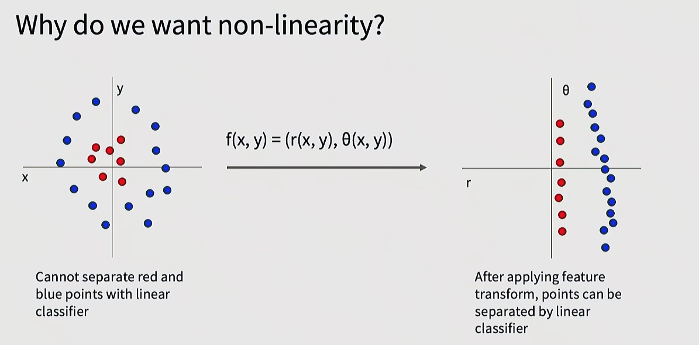
  - you can keep adding layers...
  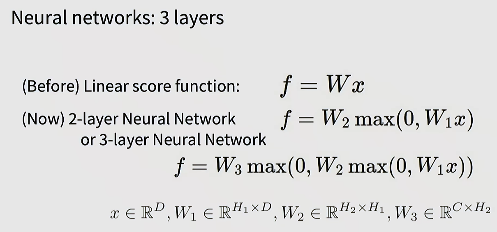

- using more layers, the neural network can learn more templates:
 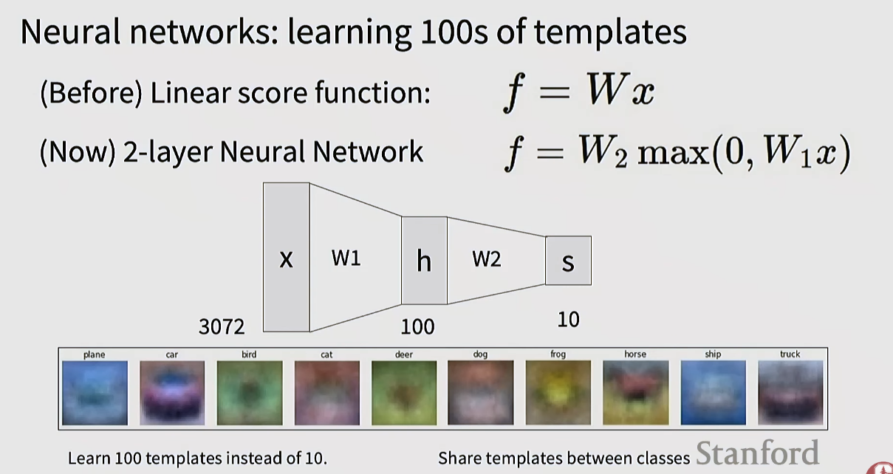

- what happen if we try to build a neural network without an activation function?
 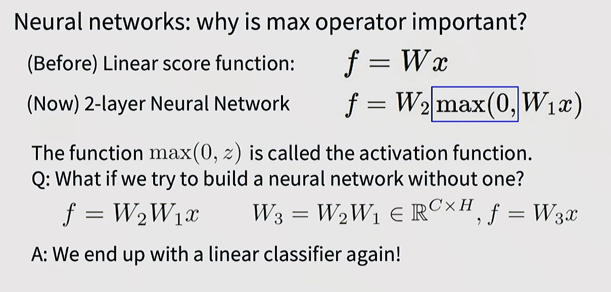

- what are activations functions?
  - activation functions are mathematical functions used inside neural networks to introduce non-linearity.
  - without activation functions → a neural network is just a linear model.
  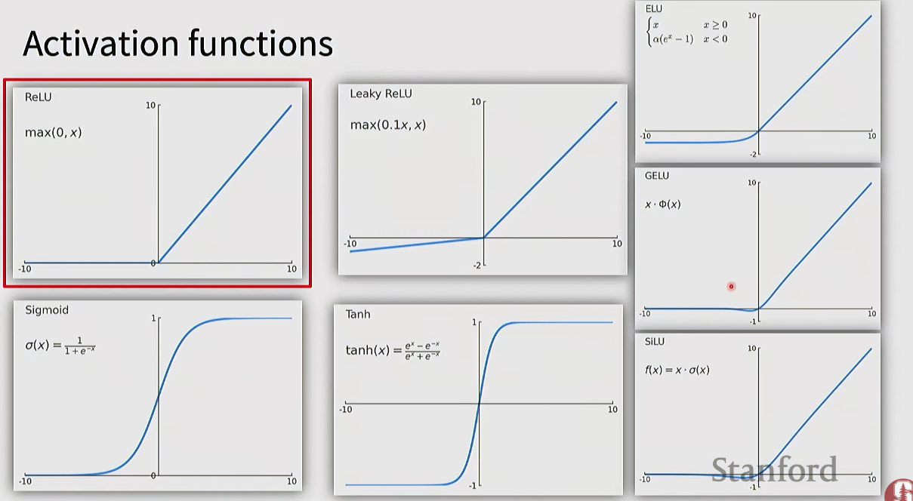

- architecture and minimal implementation of a neural network:
  
  
  

- what does more neurons in a neural network usually means?
  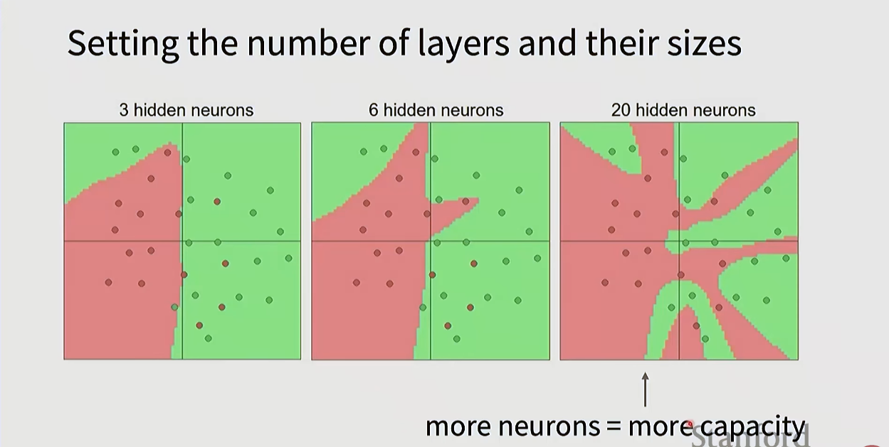

- as a rule of thumb, do not use the size of a neural network as a "regularizer". use a stronger regularization instead:
   

- neural networks playground:
  - https://playground.tensorflow.org/
  - https://cs.stanford.edu/people/karpathy/convnetjs/demo/classify2d.html

- similarities between our brain neurons and a neural network:
  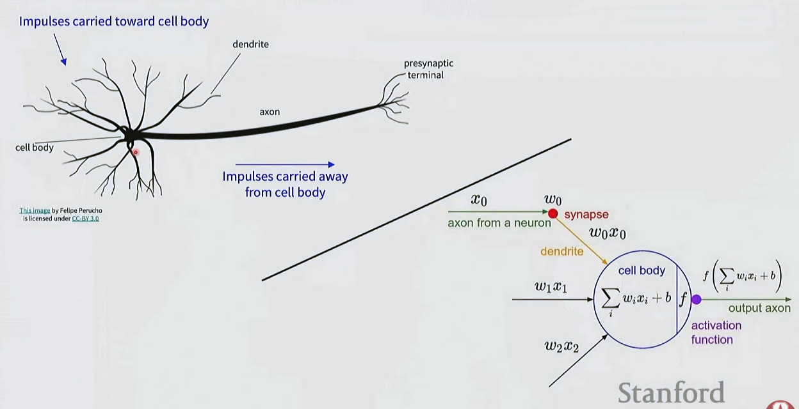
  
  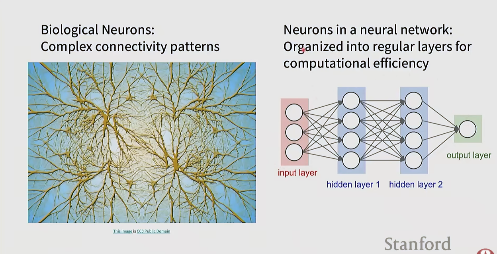
  

- what is the problem of computing gradients in a neural network?
  - manually computing gradients requires lots of messy matrix calculus.
  - changing anything (loss function, model structure) means re-deriving everything again.
  - for realistic neural networks, manual derivation is impossible and unscalable.
  - therefore: we need automatic differentiation, not hand-written gradients.
  - even a small 2-layer network (W₂ · ReLU(W₁x)) already produces complex derivatives!
  - loss = hinge loss + regularization → more things to differentiate.
  - to train the model we need ∂L/∂W₁ and ∂L/∂W₂, but computing them manually is difficult.
  - this motivates **backpropagation**: an algorithm to compute gradients automatically.
  - 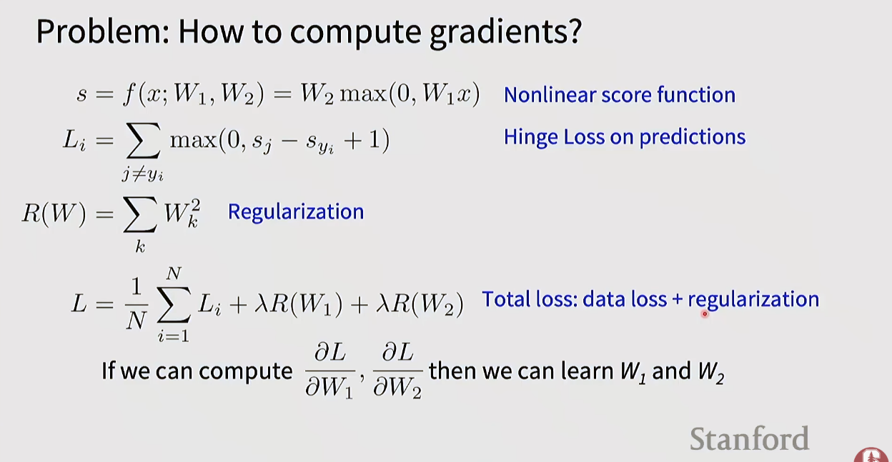

- so what is the alternative? "backpropagation" to the rescue!
  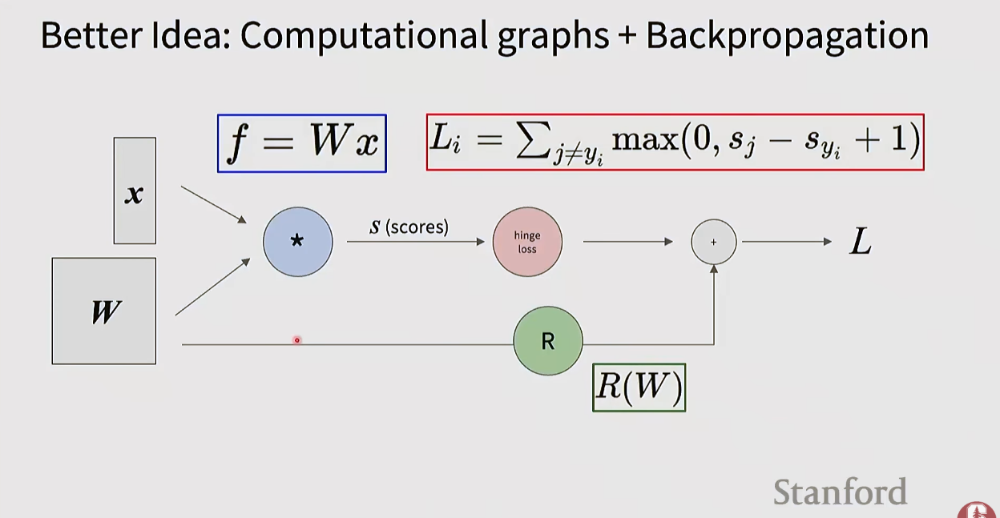
  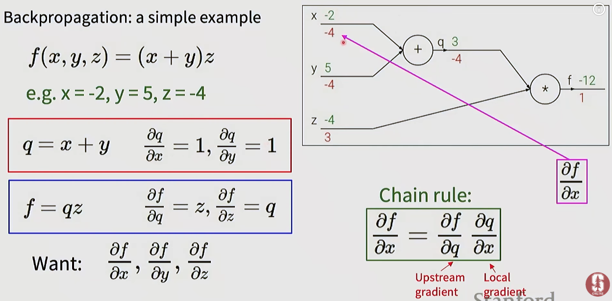
  

- in a neural network, “parameters” means ONLY the learnable weights and biases:
  - W1, W2
  - biases b1, b2
  - these are what gradient descent updates.

- parameters = learnable values (weights, biases). 
- nodes = everything in the computation graph (inputs, additions, multiplications, activations). 
- backprop computes gradients for all nodes, but only uses the gradients of parameters to update the model.


- important points to remember for backpropagation:
  - first pass: We evaluate the function (the forward pass). 
  - second pass: We go backwards using the chain rule. the “upstream gradient” is simply the gradient that has been accumulated up to this point. 
  - local gradient: This is just the derivative of the current operation with respect to its inputs.

- modularized implementation: forward / backward API
  
  
  - PyTorch sigmoid layer: 
    
    
    

- vector derivatives
  - derivative = “if I nudge x, how does y move?”
  - gradient = “if i nudge each coordinate of x, how does y move?”
  - jacobian = “if i nudge each coordinate of x, how does each coordinate of y move?”
  
  
  
  
  
  - backprop = repeated application of the vector chain rule
  - the vector chain rule requires the Jacobian
  - ReLU’s Jacobian happens to be diagonal (so it’s easy)
  - neural networks never build Jacobian matrices explicitly, but the concept explains how gradients flow

- in backpropagation remember the following:
  - forward: compute the loss
  - backward: compute the gradients
  - and the update phase uses the gradients to change your weights.

- ICLR is a real, major academic conference in machine learning — especially focused on representation learning / deep learning.
  - ICLR publishes research on topics like representation learning, optimization, neural networks, etc.
  - Website: https://iclr.cc/
  

- different ways of doing image classification:
  - linear classifier:
    
  - image features (old way):
    
    - color histogram 
    
    - histogram of oriented gradients (HoG):
    
    - so... the idea was to "mix" many features and try to classify the image:
    
  - end to end neural network:
    

- since all the all pixels are stacked into a single long vector, the spatial structure of images is destroyed.
  - what is lost?
    - local patterns
    - edges
    - shapes
    - spatial relationships
- CNNs solve this by keeping the image as a 2D grid and using special operations that respect spatial structure.
  - convolution = sliding small filters over the image to detect patterns.
  - CNNs dominated all vision tasks between ~2012 - 2020
  - the word “convolutional” comes from the noun “convolution” and means something twisted, complicated, or folded together.
  - in math, a convolution is when you: 
    - take a small function,
    - slide it across another function,
    - combine their values by overlapping.
  - so two things "fold into each other" as one slides over the other...
  
  
  - [Gradient-based learning applied to document recognition](http://vision.stanford.edu/cs598_spring07/papers/Lecun98.pdf)
  
  - [ImageNet Classification with Deep Convolutional Neural Networks "AlexNet"](https://proceedings.neurips.cc/paper_files/paper/2012/file/c399862d3b9d6b76c8436e924a68c45b-Paper.pdf) 
  
  - [Faster R-CNN: Towards Real-Time Object Detection with Region Proposal Networks](https://arxiv.org/pdf/1506.01497)
  
  - [Deep Visual-Semantic Alignments for Generating Image Descriptions](https://arxiv.org/pdf/1412.2306)
  
  - [High-Resolution Image Synthesis with Latent Diffusion Models](https://arxiv.org/pdf/2112.10752)
  
  - [Attention Is All You Need](https://proceedings.neurips.cc/paper_files/paper/2017/file/3f5ee243547dee91fbd053c1c4a845aa-Paper.pdf)
  - [An Image is Worth 16x16 Words: Transformers for Image Recognition at Scale](https://arxiv.org/pdf/2010.11929)
  

- a fully connected layer looks at the entire image at once, while a convolutional layer looks at local regions using small filters, slides them across the image, and stacks their responses into a multi-channel feature map.
  
  
  
  
  
  

- for CNNs we sometimes work with batches for images instead of a single image:
  
  

- a ConvNet is a neural network with a bunch of convolutional layers!
  
  - we need to add activation layers in between, because a composition of convolutional layers is still linear, so there won’t be any difference compared to having just one layer.  
  

- what does the ConvNet learn?
  
  
  
  

- how to calculate the spatial dimensions of a convolution?
  
  
  
  

- what is the receptive field? 
  - the receptive field tells you how much of the original image affects a particular neuron in a deep layer. The more layers you stack, the larger the part of the image each neuron “sees.”
  - in this CNN context, a “neuron” simply means: a single value (or cell) in a feature map, so:
    - one pixel in the input image,
    - or one pixel in a hidden feature map,
    - or one pixel in the final output map.
  - all of these are neurons in a convolutional neural network.
  
  
  
  

- what is a strided convolution?
  - a strided convolution moves the filter in larger steps, which downsamples the image (reduces its spatial size) while still extracting features.
  - think of a camera scanning an image:
    - stride 1 = take a picture at every pixel
    - stride 2 = take a picture every 2 pixels → fewer pictures → smaller output
  - in this example the filter move like this:
    - (0,0) → (0,2) → (0,4)
    - (2,0) → (2,2) → (2,4)
    - (4,0) → (4,2) → (4,4)
  

- convolution examples:
  
  
  

- convolutions in pytorch:
  
  
- what are pooling layers? 
  - pooling layers are a simple way to shrink (downsample) feature maps in a CNN while keeping the important information. 
  - they don’t learn anything — they just apply a fixed rule like max or average.
  - note that max pooling introduces non-linearity, so you may not need ReLU after a max-pooling operation. 
  - if it is average pooling, this is a linear operator, which means you will probably need a ReLU afterward.
  
  

- pooling summary:
  

- what is translation equivariance? 
  - translation equivariance means the network recognizes the same features even if the object moves to a different spot in the image.
  - 🐸 intuition from the frog image:
    - you take an image of a frog.
    - you shift it a bit to the right or down.
    - you apply a convolution or pooling.
    - the features (edges, textures, patterns) you detect simply shift to the new place, but stay the same.
  
  
  

- what are the components of CNNs?
  

- [Layer normalization](https://arxiv.org/pdf/1607.06450) (LayerNorm):
  - is a normalization method that normalize each sample’s features to stabilize training and make the network learn faster. 
  - you take one training example at a time.
  - you compute the mean and standard deviation across its features.
  - you do not look at other examples in the batch.
  - each sample is normalized independently.
  - example: 
    - input (2 samples, 3 features):
    - x =
    - [ 1   2   3 ]
    - [ 4   5   6 ]
    - sample 1: [1 2 3]
    - mean = 2
    - std  = 1
    - normalized = [ (1-2)/1 , (2-2)/1 , (3-2)/1 ]
    - = [ -1 , 0 , 1 ]
  

- Other normalization methods: 
    
    - all of this normalization are in `torch.nn`
      - `nn.BatchNorm2d(num_features=2)`
      - `nn.LayerNorm(normalized_shape=[2, 2, 2])`
      - `nn.InstanceNorm2d(num_features=2, affine=True)`
      - `nn.GroupNorm(num_groups=1, num_channels=2)`
    - [Group Normalization](https://arxiv.org/pdf/1803.08494)

- What is regularization Dropout?
  - dropout is a technique where, during training, we randomly:
    - turn off (set to zero) some neurons
    - with a certain probability (e.g., 0.5)
  - [Dropout: A Simple Way to Prevent Neural Networks from Overfitting](https://www.jmlr.org/papers/volume15/srivastava14a/srivastava14a.pdf) 
    
  - why does Dropout help with overfitting?
    - it prevents neurons from relying on each other too much
      - without dropout, neurons can "co-adapt":
      - neuron A always relies on neuron B
      - so the model memorizes patterns too closely → overfitting
    - it acts like training many different networks at once
      - because each training pass has a different subset of active neurons, dropout:
    - it adds noise during training → makes the model more robust
      - randomly removing neurons adds noise to internal representations.
      - this prevents the model from memorizing the training data.
    - pytorch: `self.drop = nn.Dropout(p=0.5)`
  - how can this possibly be a good idea?
    
    
    
  
- What is the goal of activation functions?
  

- In which regions does sigmoid have a small gradient?
  
  
  - this saturation issue is why "ReLU" became really popular:
  - in sigmoid when neurons receive large positive or negative inputs:
    - they move into the “flat” part of the sigmoid
    - their gradient almost disappears
    - gradients vanish during backpropagation
  
  - ReLU is not perfect... since for gradient of negative numbers we have always 0, to improve on this:
  - GeLU is the main activation function use in transformers today
  
  - the activation function zoo:
  
  - where are activations used in CNNs?
  

- number of layers vs. error rate for the ImageNet winners:
  
  

- in AI we plot architectures using block diagrams as the one below.
- each block represents a layer or a group of layers
- helps to gain intuition of the different layers with a glance
  
- what is the effective receptive field of three 3x3 conv (stride 1) layers?
  - stack of three 3x3 conv (stride 1) layers has the same effective receptive field as one 7x7 conv layer  
    
    
    
    
    
  - it has fewer parameters as well:
    

- why deeper models sometimes perform worse than shallower models?
  
  
  - ResNet helps deep networks learn better by letting each block only learn what changed, not everything from scratch:
  
  
  - RestNet architecture:
  

- what happens if you initialize your neural network with weights that are **too small**?
- using weights that are too small causes activations to shrink toward zero in deep networks, making learning impossible.
- deep networks need signals to flow forward through layers.
- if the weights are too small:
  - the signal keeps shrinking
  - after many layers, the numbers get close to zero
  - the network outputs almost nothing
  - gradients during training also become tiny
    - → The network cannot learn
  - this problem is called vanishing activations (related to vanishing gradients).
  

- what happens if you initialize your neural network with weights that are **too large**?
- if weights are slightly too large, the network amplifies values every layer until everything becomes huge and unstable, making training impossible.
- this is called **activation explosion** or **blowup**.
- so...
- 🔹 Weights too small → activations shrink to zero.
- 🔺 Weights too large → activations explode (blow up).
  - if W is 5× larger than before:
    - each dot product becomes 5× larger
    - after layer 2, it's ~25× larger
    - after layer 3, ~125×
    - after layer 4, ~625×
  

- a solution for initializing the weights: Kaiming / MSRA initialization
  - [Delving Deep into Rectifiers: Surpassing Human-Level Performance on ImageNet Classification](https://arxiv.org/pdf/1502.01852)
  - this method chooses the standard deviation of the weights so that:
    - after multiplication by the weight matrix
    - and after the ReLU
  - ...the output activations stay at the same scale as the input activations.
  
  - pytorch uses He/Kaiming initialization by default in many layers (e.g., nn.Conv2d, nn.Linear when using ReLU).
  - and you can apply it manually: `torch.nn.init.kaiming_uniform_(tensor, a=0, mode='fan_in', nonlinearity='relu')`
  - other methods:
    - `torch.nn.init.xavier_uniform_(tensor)`
    - `torch.nn.init.orthogonal_(tensor)`
    - `torch.nn.init.constant_(tensor, value=0.1)`
    - `torch.nn.init.uniform_(tensor, a=-0.1, b=0.1)`
    - `torch.nn.init.normal_(tensor, mean=0.0, std=0.02)`
  - why pytorch prefers Kaiming for ReLU networks?
    - because ReLU networks dominate modern deep learning, and He initialization:
    - prevents vanishing activations
    - prevents exploding activations
    - keeps gradients stable
    - enables training of very deep networks (ResNets, VGG, etc.)

- why do we need image normalization in neural networks?
  - neural networks work best when their inputs are well-behaved numeric distributions. 
  - raw images are not well-behaved:
    - pixel values are typically 0–255
    - different channels (R, G, B) have different brightness distributions
    - variance across channels can differ a lot
  - normalization fixes these issues.
  - `norm_pixel[i,j,c] = (pixel[i,j,c] - mean[c]) / std[c]`
    - mean for R, G, B 
    - std for R, G, B
  - benefits:
    - makes optimization easier (gradient descent becomes stable)
      - converges faster
      - less likely to explode or vanish gradients
    - prevents one channel from dominating others
      - example: in many datasets, the green channel has higher average intensity than red or blue.
    - makes training more consistent across images
      - makes the model focus on actual structure, not brightness differences.
    - allows pretrained models to work correctly
      - pretrained models like: ResNet, VGG, EfficientNet
      - if your input is not normalized with the same values:
        - performance drops
        - features don’t match what the model expects
  - because every image must be individually preprocessed, many practitioners rely on precomputed normalization values to make the process faster and more efficient.
  

- regularization injects randomness during training but removes it during inference.
  - why?
    - randomness during training → prevents overfitting
    - no randomness during testing → stable, deterministic predictions
    - averaging effect → smoother, more generalizable model
  

- data augmentation: increasing the size of your dataset
  
  
  
  
  

- what if you don't have a lot of data? can you still train a CNNs?
  - yes, with transfer learning...
  
  
  
  

- guidelines to choose hyperparameters:
  
  
  
  
  
  - in practice selecting randomly hyperparameters work better than grid-based:
  - [Random Search for Hyper-Parameter Optimization](https://www.jmlr.org/papers/volume13/bergstra12a/bergstra12a.pdf)
  
  